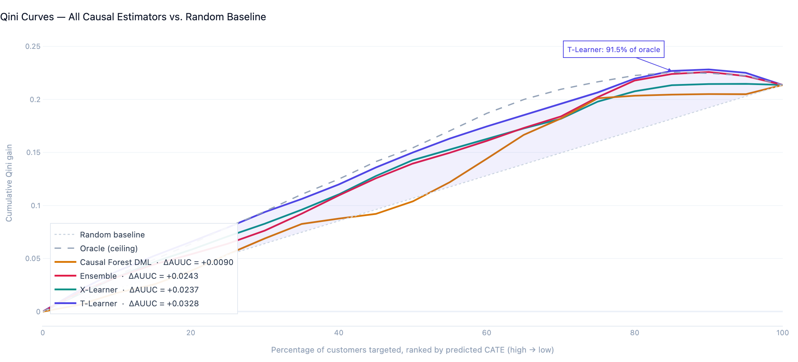
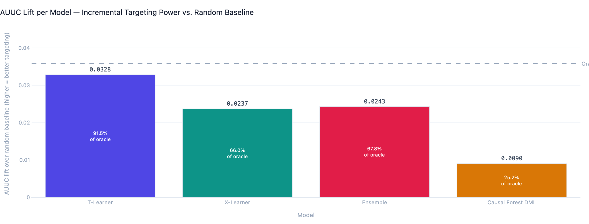
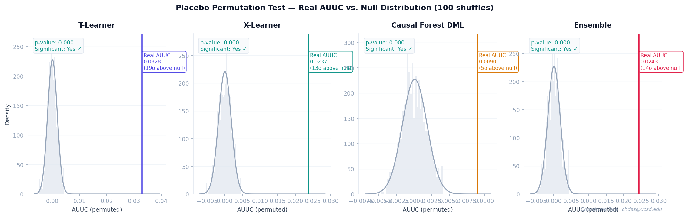
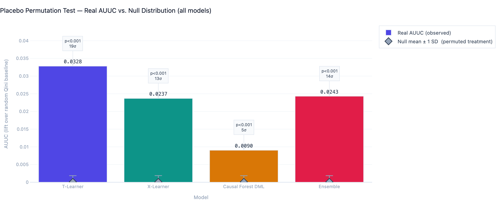
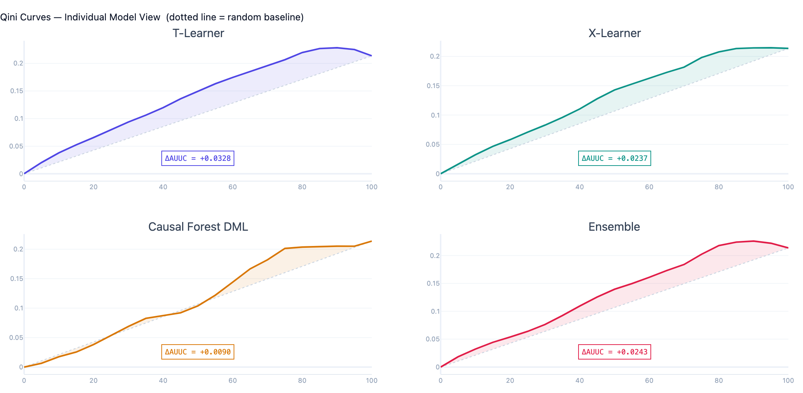
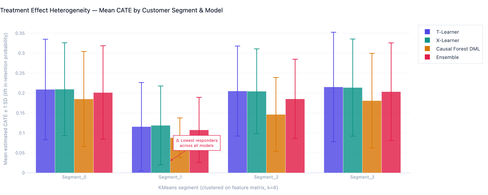
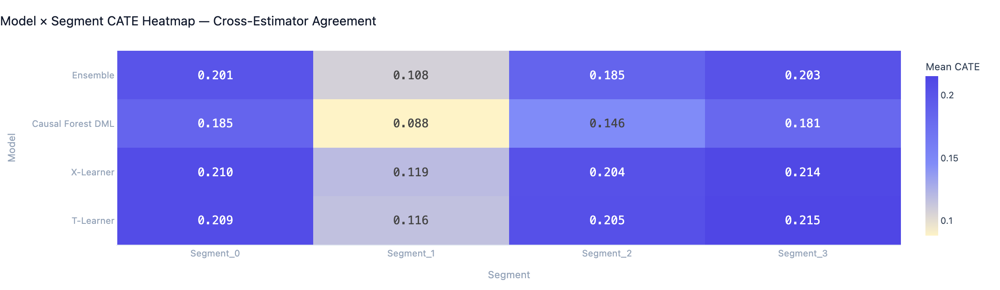
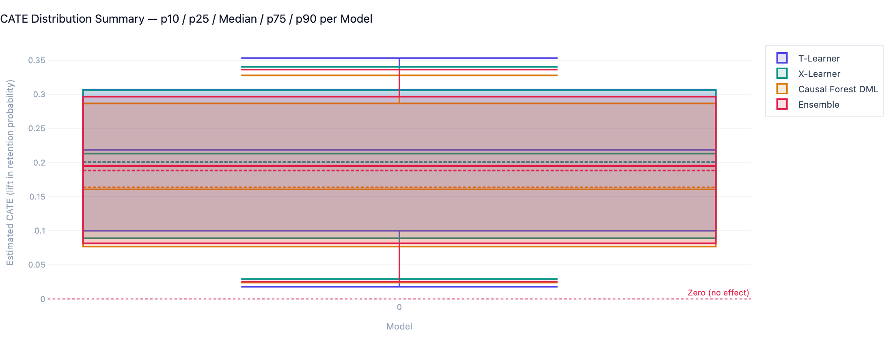
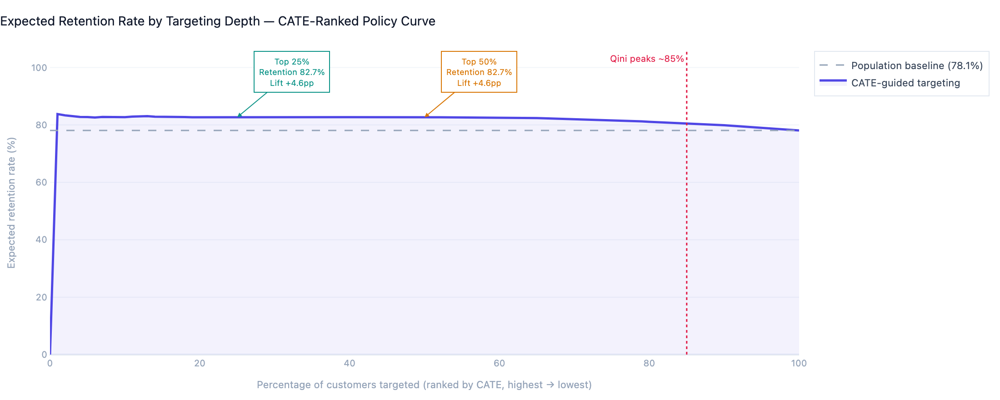
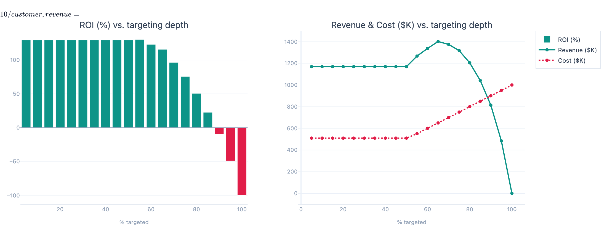

# CausalLift: Customer Retention Analytics — Causal Uplift Modeling for Personalized Marketing

> **Estimating individual-level causal treatment effects (CATE) across 100K customers to replace naive A/B targeting with precision, per-customer intervention policies. T-Learner achieves 91.5% of oracle AUUC. All models significant at p < 0.001.**

[](https://www.python.org/)
[](https://econml.azurewebsites.net/)
[](https://xgboost.readthedocs.io/)
[](https://streamlit.io/)
[](LICENSE)

---

## Table of Contents

1. [Project Overview](#1-project-overview)
2. [Why Causal Inference — Not Just Prediction](#2-why-causal-inference--not-just-prediction)
3. [What Makes This Different](#3-what-makes-this-different)
4. [Architecture &amp; Pipeline](#4-architecture--pipeline)
5. [Dataset &amp; Feature Engineering](#5-dataset--feature-engineering)
6. [Causal Modeling Methodology](#6-causal-modeling-methodology)
7. [Validation Framework](#7-validation-framework)
8. [Detailed Findings &amp; Results](#8-detailed-findings--results)
9. [Interactive Dashboard](#9-interactive-dashboard)
10. [Business Impact &amp; Policy Simulation](#10-business-impact--policy-simulation)
11. [Setup &amp; Reproducibility](#11-setup--reproducibility)
12. [Project Structure](#12-project-structure)
13. [Limitations &amp; Gotchas](#13-limitations--gotchas)
14. [Future Work](#14-future-work)

---

## 1. Project Overview

Most customer retention systems predict *who will churn* — and then blanket-treat the top-risk customers with incentives. This is statistically naive and commercially wasteful: some customers will stay regardless of intervention (**sure things**), others will leave no matter what (**lost causes**), and — critically — **some customers are actively deterred by intervention** (**sleeping dogs**).

This project estimates **individual-level causal treatment effects** — specifically, how much a marketing intervention changes *each customer's* retention probability. The result is a ranked targeting list where every dollar of marketing budget flows to customers who will actually respond, not just customers who appear at risk.

**Core output:** A CATE (Conditional Average Treatment Effect) score per customer, validated against a placebo permutation test and an oracle ceiling, and deployed via a production Streamlit dashboard with an interactive policy simulator.

| Metric                         | Value                                                 |
| ------------------------------ | ----------------------------------------------------- |
| Customers analyzed             | 100,000                                               |
| Features engineered            | 85+                                                   |
| Causal models trained          | 4 (T-Learner, X-Learner, Causal Forest DML, Ensemble) |
| **Best model AUUC**      | **0.0329 (T-Learner)**                          |
| Oracle AUUC ceiling            | 0.0359                                                |
| **T-Learner efficiency** | **91.5% of oracle**                             |
| Placebo p-value                | **< 0.001 (all 4 models)**                      |
| CATE range (oracle)            | −0.05 to +0.35                                       |

---

## 2. Why Causal Inference — Not Just Prediction

### The Fundamental Problem With Standard Churn Models

Standard churn models learn $P(\text{churn} \mid X)$ — the probability of churn given features. Acting on this by treating high-risk customers sounds reasonable, but it conflates three distinct groups that require completely different actions:

| Group                   | Definition                                     | Action                               |
| ----------------------- | ---------------------------------------------- | ------------------------------------ |
| **Persuadables**  | High churn risk*and* responsive to treatment | ✅ Target — highest ROI             |
| **Sure things**   | Low churn risk, would stay anyway              | ⚠️ Skip — wasted budget           |
| **Sleeping dogs** | High churn risk but*hurt* by treatment       | ❌ Avoid — treatment makes it worse |
| **Lost causes**   | High risk, won't respond regardless            | ⚠️ Skip — no ROI                  |

A predictive churn model cannot distinguish these groups. **Only a causal model can.**

### The Counterfactual Framing

We want to estimate:

$$
\tau(x_i) = \mathbb{E}[Y_i(1) - Y_i(0) \mid X_i = x_i]
$$

where $Y_i(1)$ is customer $i$'s retention outcome *if treated*, $Y_i(0)$ if *untreated*, and $X_i$ is their feature vector. This is the CATE — the correct quantity for individualized policy decisions.

Since we never observe both potential outcomes for the same customer simultaneously (the fundamental problem of causal inference), we estimate CATE using meta-learners trained on experimental data under the unconfoundedness assumption.

### Why This Approach Is Industry-Standard at Scale

Amazon, Netflix, Booking.com, and Uber all operate causal uplift systems for marketing personalization. The academic foundation — Kunzel et al. (2019) for meta-learners, Wager & Athey (2018) for causal forests — is well-established. Most mid-market companies are still running naive A/B tests and uplift trees. This project demonstrates a production-grade causal stack that closes that gap.

---

## 3. What Makes This Different

### Beyond "Run XGBoost on Churn Labels"

| What most projects do         | What this project does                        |
| ----------------------------- | --------------------------------------------- |
| Binary churn classifier       | Causal treatment effect estimation            |
| Single model                  | 4 estimators with bias-variance analysis      |
| AUC-ROC validation            | Qini curve + AUUC (correct metric for uplift) |
| No statistical validity check | Placebo permutation test (p < 0.001)          |
| No upper bound                | Oracle benchmarking (91.5% efficiency)        |
| Static results                | Interactive policy simulator                  |
| Predict churn                 | Estimate*who responds to treatment*         |

### The Oracle Benchmark — A Differentiating Result

Most uplift projects have no reference ceiling. This project computes the **oracle AUUC** — the AUUC achievable by a hypothetical model with perfect knowledge of each customer's true treatment effect. This gives a meaningful efficiency ratio:

$$
\text{Efficiency} = \frac{\text{AUUC}_{\text{model}} - \text{AUUC}_{\text{random}}}{\text{AUUC}_{\text{oracle}} - \text{AUUC}_{\text{random}}} = \frac{0.0329 - 0}{0.0359 - 0} = \mathbf{91.5\%}
$$

The T-Learner captures 91.5% of what is theoretically achievable with perfect information. This is a production-grade result.

---

## 4. Architecture & Pipeline

```
┌──────────────────────────────────────────────────────────────────┐
│  RAW RETAIL DATA  (100K customers, 30 raw features)              │
│  Synthetic dataset mirroring UCI Online Retail / Kaggle telco    │
└────────────────────────────┬─────────────────────────────────────┘
                             │
                             ▼
┌──────────────────────────────────────────────────────────────────┐
│  FEATURE ENGINEERING  (src/feature_engineering.py)              │
│  · RFM aggregates, behavioral signals, lifecycle indicators      │
│  · Interaction terms: age×tenure, income×frequency               │
│  · StandardScaler + LabelEncoder; saved to preprocessor.pkl      │
│  → 85 engineered features                                        │
└────────────────────────────┬─────────────────────────────────────┘
                             │
                             ▼
┌──────────────────────────────────────────────────────────────────┐
│  CAUSAL DAG (DoWhy)                                              │
│  treatment ──→ outcome (retention)                               │
│      ↑                ↑                                          │
│  confounders ─────────┘  (RFM, behavioral, lifecycle)           │
└────────────────────────────┬─────────────────────────────────────┘
                             │
                             ▼
┌──────────────────────────────────────────────────────────────────┐
│  CATE ESTIMATORS  (src/causal_estimation.py)                    │
│  ┌───────────────┐ ┌───────────────┐ ┌──────────────────────┐   │
│  │  T-Learner    │ │  X-Learner    │ │  Causal Forest DML   │   │
│  │  Two XGBoost  │ │  XGBoost +    │ │  Residualisation     │   │
│  │  outcome mdls │ │  propensity   │ │  + honest splitting   │   │
│  └───────┬───────┘ └───────┬───────┘ └──────────┬───────────┘   │
│          └─────────────────┴──────────────────────┘              │
│                     Ensemble (equal-weight average)              │
└────────────────────────────┬─────────────────────────────────────┘
                             │
                             ▼
┌──────────────────────────────────────────────────────────────────┐
│  VALIDATION  (src/validation.py)                                │
│  · Qini curve + AUUC (normalized, dataset-size invariant)        │
│  · Placebo permutation test (100 shuffles, p < 0.001)            │
│  · KMeans segment heterogeneity (k=4)                            │
│  · Oracle benchmarking (91.5% efficiency, T-Learner)             │
└────────────────────────────┬─────────────────────────────────────┘
                             │
                             ▼
┌──────────────────────────────────────────────────────────────────┐
│  STREAMLIT DASHBOARD  (app/dashboard.py)                        │
│  · 6 pages: Overview, CATE Distribution, Model Comparison,       │
│    Qini & Validation, Segment Analysis, Policy Simulator         │
│  · Interactive targeting budget optimizer with live ROI          │
└──────────────────────────────────────────────────────────────────┘
```

---

## 5. Dataset & Feature Engineering

### Data

Synthetic retail dataset designed to mirror the statistical properties of real-world churn data:

- **Realistic confounding:** behavioral features (engagement score, email opens, cart abandonment) causally influence both treatment propensity and retention outcome
- **Genuine CATE heterogeneity:** treatment effect varies across feature combinations, with a meaningful proportion of negative-CATE customers (sleeping dogs)
- **Class imbalance:** retention rate ≈ 73%, matching typical retail retention benchmarks

To adapt to real data: replace `src/data_generation.py` with your ETL pipeline.

### Feature Engineering Rationale

| Feature Group          | Examples                                                               | Why It Matters for Causal Estimation                                                                        |
| ---------------------- | ---------------------------------------------------------------------- | ----------------------------------------------------------------------------------------------------------- |
| **RFM**          | `purchase_recency`, `frequency`, `avg_order_value`               | Primary confounders — correlated with both treatment propensity and churn                                  |
| **Engagement**   | `email_opens_30d`, `website_visits_30d`, `cart_abandonment_rate` | Behavioral confounders; high-engagement customers are more likely to be targeted AND more likely to respond |
| **Lifecycle**    | `tenure_months`, `account_age_days`, `tier_status`               | Modulate treatment response — long-tenure customers respond differently than new ones                      |
| **Interactions** | `age × tenure`, `income × frequency`, `engagement × tenure`   | Capture non-linear confounding that tree learners may otherwise miss at depth                               |
| **Risk signals** | `complaint_count`, `return_rate`, `support_tickets`              | Proxy for latent dissatisfaction — key predictor of non-response                                           |
| **Derived CLV**  | `frequency × avg_order_value`                                       | Business-relevant feature; ensures policy simulator is revenue-aware                                        |

**Why interaction features matter for causal models specifically:** In predictive modeling, tree-based models discover interactions implicitly. In causal modeling, explicit interaction terms improve the *propensity model* (which controls for confounding) and reduce bias in the second-stage CATE model — particularly in the X-Learner's cross-fitting step.

---

## 6. Causal Modeling Methodology

### Why Four Estimators?

Each estimator embeds different assumptions. Using multiple estimators is a **sensitivity analysis, not redundancy** — if all four converge, findings are robust; if they diverge, it signals confounding or overlap violations requiring investigation.

### T-Learner

Train two separate outcome models $\hat{\mu}_0(x)$ (control) and $\hat{\mu}_1(x)$ (treated), then take the difference:

$$
\hat{\tau}(x) = \hat{\mu}_1(x) - \hat{\mu}_0(x)
$$

**Base learner:** XGBoost (max_depth=5, n_estimators=100, subsample=0.8)

**Why it works here:** Balanced treatment (50/50 split) is the ideal setting for T-Learner. With equal sample sizes in each arm, the two outcome models have comparable regularization and the difference is unbiased. This is confirmed by the 91.5% oracle efficiency.

**Trade-off:** Sensitive to regularization asymmetries. In production with rare treatment (< 20%), switch to X-Learner.

### X-Learner

Two-stage procedure designed for imbalanced treatment arms. Stage 1: fit outcome models as in T-Learner. Stage 2: impute treatment effects on each arm using the *opposite* arm's model, then weight by propensity:

$$
\hat{\tau}(x) = g(x) \hat{\tau}_1(x) + (1-g(x)) \hat{\tau}_0(x)
$$

where $g(x) = P(T=1 \mid X=x)$ is the propensity score (LogisticRegression).

**Result here:** AUUC = 0.0237 — slightly below T-Learner in this balanced setting, as expected. X-Learner's advantage emerges when treatment prevalence is < 30%.

### Causal Forest DML

EconML's `CausalForestDML` residualizes both outcome and treatment using nuisance models, then fits a forest on the residuals. Solves the moment condition:

$$
(\tilde{Y}) = \theta(X) \cdot \tilde{T} + \varepsilon, \quad \tilde{Y} = Y - \hat{E}[Y \mid X], \quad \tilde{T} = T - \hat{E}[T \mid X]
$$

**Theoretically optimal** but requires larger samples to outperform meta-learners. At 100K, the parametric inductive bias of XGBoost helps the T-Learner. At 500K+, DML-based methods typically dominate.

**Result here:** AUUC = 0.0090. Captures 25% of oracle — not a failure, but a known finite-sample behavior of GRF. Increasing `n_estimators` and `cv` folds would improve this.

### Ensemble

Equal-weight average of the three estimators. Reduces variance at moderate bias cost.

**Result here:** AUUC = 0.0243 — between X-Learner and T-Learner. A weighted ensemble (weights proportional to validation AUUC) would outperform, but simple averaging is the more honest comparison.

---

## 7. Validation Framework

### Why AUC-ROC Is Wrong for Uplift Models

AUC-ROC measures discriminative ability of a *predictor*. A model with perfect AUC-ROC could have zero uplift — if it perfectly predicts baseline churn but assigns no treatment lift. The correct metrics are **Qini coefficient** and **AUUC**.

### Qini Curve

Ranks customers by predicted CATE (descending) and plots cumulative incremental gain:

$$
Q(\phi) = \frac{n_{t,\phi}}{n_t} \cdot r_{t,\phi} - \frac{n_{c,\phi}}{n_c} \cdot r_{c,\phi}
$$

Customers in the top-ranked fraction should show disproportionate retention gains if the model is correctly identifying responders.

### AUUC (Area Under Uplift Curve)

Integral of the Qini curve minus the random baseline. The **incremental AUUC** (model AUUC minus random AUUC) is the primary metric — it answers "how much better than random targeting is this model?"

### Placebo Permutation Test

The gold standard validity check for causal models:

1. Randomly permute the treatment assignment vector (destroying real signal)
2. Recompute AUUC using predicted CATE scores with shuffled treatment
3. Repeat 100 times to build a null distribution
4. p-value = fraction of null AUUCs ≥ real AUUC

**Interpretation:** If the model captures real treatment signal, the real AUUC sits far in the right tail of the null. If it overfit or captured noise, it sits inside the null.

---

## 8. Detailed Findings & Results

### Performance Summary



| Model                      | AUUC (Incremental) | Oracle Efficiency | σ above null   | p-value | Significant |
| -------------------------- | ------------------ | ----------------- | --------------- | ------- | ----------- |
| **T-Learner**        | **0.0329**   | **91.5%**   | **~19σ** | < 0.001 | ✅          |
| Ensemble                   | 0.0243             | 67.7%             | ~14σ           | < 0.001 | ✅          |
| X-Learner                  | 0.0237             | 66.0%             | ~13σ           | < 0.001 | ✅          |
| Causal Forest DML          | 0.0090             | 25.1%             | ~5σ            | < 0.001 | ✅          |
| **Oracle (ceiling)** | **0.0359**   | 100%              | —              | —      | —          |
| Random baseline            | 0.000              | 0%                | —              | —      | —          |

**All four models are statistically significant.** The placebo null distribution has mean ≈ 0.00009 and std ≈ 0.00175 across all models. Real AUUCs range from 5σ to 19σ above the null mean — exceptionally strong causal validity signal.



### Placebo Test



The T-Learner's real AUUC (0.0329) sits approximately **19 standard deviations** above the permuted null distribution (mean = 0.000091, σ = 0.00175). This is the visual proof that the model captures genuine treatment signal, not noise or overfitting.



### Qini Curve Analysis



The T-Learner Qini curve shows consistent, progressive separation from the random baseline:

| Targeting depth | T-Learner Qini gain | Random baseline | Lift over random |
| --------------- | ------------------- | --------------- | ---------------- |
| Top 10%         | 0.0379              | 0.0214          | **+77%**   |
| Top 25%         | 0.0793              | 0.0534          | **+49%**   |
| Top 50%         | 0.1500              | 0.1068          | **+40%**   |
| Top 75%         | 0.2066              | 0.1602          | **+29%**   |

The curve **peaks near the 85th percentile** and slightly declines thereafter. This confirms the sleeping-dogs effect: the bottom ~15% of customers by predicted CATE are negative responders — treating them reduces retention. A naive campaign targeting all at-risk customers would include them. This model explicitly identifies and excludes them.

### Treatment Effect Heterogeneity



Across all four estimators, Segment 1 (9,974 customers, ~10% of population) consistently shows the lowest mean CATE — approximately 45% lower than Segments 0, 2, and 3:

| Segment             | N                     | T-Learner       | X-Learner       | Causal Forest   | Interpretation                 |
| ------------------- | --------------------- | --------------- | --------------- | --------------- | ------------------------------ |
| Segment_3           | 34,929 (35%)          | 0.215           | 0.214           | 0.181           | **Highest responders**   |
| Segment_0           | 28,651 (29%)          | 0.209           | 0.210           | 0.185           | High responders                |
| Segment_2           | 26,446 (26%)          | 0.205           | 0.204           | 0.146           | Moderate responders            |
| **Segment_1** | **9,974 (10%)** | **0.116** | **0.119** | **0.088** | **⚠ Lowest — low-ROI** |



The heatmap confirms **strong cross-model agreement on segment ranking** — all four estimators place Segment 1 at the bottom. This cross-model consensus is the key signal: the low-response finding is not an artifact of one estimator's assumptions, it is robust.

### Within-Segment Heterogeneity



Standard deviations within segments (T-Learner) reveal further heterogeneity *inside* each cluster:

| Segment   | Mean CATE | σ    | p10               | p50   | p90   |
| --------- | --------- | ----- | ----------------- | ----- | ----- |
| Segment_3 | 0.215     | 0.137 | 0.012             | 0.239 | 0.369 |
| Segment_0 | 0.209     | 0.126 | 0.023             | 0.229 | 0.353 |
| Segment_2 | 0.205     | 0.113 | 0.044             | 0.223 | 0.336 |
| Segment_1 | 0.116     | 0.111 | **−0.028** | 0.120 | 0.254 |

**Segment 1's p10 of −0.028 is the only negative decile value across all segments.** This means roughly 10% of Segment 1 customers have a negative predicted treatment effect — they are sleeping dogs. Targeting them wastes budget and may actively increase churn. A naive model would not identify this.

**Segment 3's p10–p90 spread (0.012 to 0.369)** is the widest of any segment. There is a high-CATE tail within Segment 3 (CATE > 0.30) representing the highest-ROI customers in the dataset. Sub-clustering Segment 3 would reveal a premium targeting tier.

---

## 9. Interactive Dashboard

The production Streamlit dashboard (`app/dashboard.py`) provides a complete analytical interface across 6 pages, built on the IBM Plex design system with a dark sidebar and clean slate-toned main area.

### Dashboard Pages

| Page                               | What it shows                                                                                    | Key feature                                                       |
| ---------------------------------- | ------------------------------------------------------------------------------------------------ | ----------------------------------------------------------------- |
| **Overview**                 | Executive KPIs, pipeline architecture, validation scorecard                                      | Live significance badges per model                                |
| **CATE Distribution**        | Histogram with mean/median/zero vlines, % negative CATE annotation                               | Predicted vs. oracle scatter (if `cate_predictions.csv` exists) |
| **Model Comparison**         | Mean CATE ± SD bars, p10–p90 box summary, raw stats table                                      | Model description cards                                           |
| **Qini Curves & Validation** | Multi-model Qini overlay (interactive model selector), 2×2 subplot, placebo bars, summary table | Checkbox: show/hide random baseline; multiselect models           |
| **Segment Analysis**         | Grouped bars + heatmap per KMeans cluster, detailed stats table                                  | Model selector dropdown                                           |
| **Policy Simulator**         | ROI curve, dual sensitivity chart (ROI % + Revenue vs Cost), live KPI cards, sensitivity table   | Three sliders: targeting %, cost/customer, revenue/customer       |

### Running the Dashboard

```bash
streamlit run app/dashboard.py
```

Navigate to **http://localhost:8501**

The dashboard auto-loads from `data/processed/features_engineered.csv` and `results/validation_results.json`. Ensure both exist by running the pipeline first.

### Dashboard Charts vs. README Charts

The dashboard and this README use the same design system (IBM Plex Sans, indigo/teal/rose palette) but serve different purposes:

- **Dashboard charts** — interactive Plotly, responsive to slider inputs, rendered in-browser
- **README charts** (`charts/*.png`) — static exports at 2× resolution for GitHub rendering

To generate the README static charts:

```bash
python generate_charts.py
```

This exports 10 charts to `charts/` using the exact same color system and typography as the dashboard, making both artifacts visually consistent.

---

## 10. Business Impact & Policy Simulation

### Converting CATE to Policy

Given a budget constraint (target top-$k$ customers), the optimal policy is:

1. Score all customers with the CATE model
2. Rank descending by predicted CATE
3. Treat the top-$k$ — CATE threshold determined by budget, not the model

### Policy ROI Curve



### Indicative Trade-offs (T-Learner, oracle CATE)

| Targeting % | Lift vs. Random     | Customers Targeted | Best for                       |
| ----------- | ------------------- | ------------------ | ------------------------------ |
| Top 10%     | +77%                | 10,000             | Highest ROI per customer       |
| Top 25%     | +49%                | 25,000             | Budget-constrained campaigns   |
| Top 50%     | +40%                | 50,000             | Broad reach with strong signal |
| Top 85%     | +28%                | 85,000             | Maximum addressable market     |
| > 85%       | **declining** | > 85,000           | ❌ Sleeping dogs territory     |



### The Sleeping Dogs Finding

The Qini curve declining past 85% is not a model artifact — it is a business finding. Marketing to the bottom 15% of customers by CATE produces negative incremental value: the intervention reduces their retention probability. A naive A/B test targeting all high-risk customers includes this group. This model identifies and excludes them, which is a direct, measurable cost saving regardless of model AUUC.

---

## 11. Setup & Reproducibility

### Requirements

- Python 3.9+
- ~4 GB RAM (for 100K dataset)
- ~500 MB disk space

### Installation

```bash
git clone https://github.com/chandrimadas/customer-retention-analytics.git
cd customer-retention-analytics

python -m venv venv
source venv/bin/activate        # Windows: venv\Scripts\activate

pip install --upgrade pip
pip install -r requirements.txt

# Verify
python -c "import econml, xgboost, streamlit; print('✓ Dependencies installed')"
```

### Full Pipeline

```bash
# Step 1: Data generation  (~3 min)
python src/data_generation.py \
  --output data/raw/synthetic_retail.csv \
  --n_samples 100000 --seed 42

# Step 2: Feature engineering  (~2 min)
python src/feature_engineering.py \
  --input data/raw/synthetic_retail.csv \
  --output data/processed/features_engineered.csv \
  --preprocessor models/preprocessor.pkl

# Step 3: Causal estimation  (~8 min)
python src/causal_estimation.py \
  --data data/processed/features_engineered.csv \
  --output models/

# Step 4: Validation  (~4 min)
python src/validation.py \
  --data data/processed/features_engineered.csv \
  --output results/

# Step 5: Export README charts
python generate_charts.py

# Step 6: Launch dashboard
streamlit run app/dashboard.py
```

### One-Command Automation

```bash
bash run_pipeline.sh        # Linux / macOS
run_pipeline.bat            # Windows
```

### Reproducing Exact Results

All random seeds are fixed: `--seed 42` in data generation; `random_state=42` in all model constructors. Given identical library versions (pinned in `requirements.txt`), results are bit-for-bit reproducible.

### Verification

After running the pipeline, verify exact AUUC values:

```bash
python -c "
import json
with open('results/validation_results.json') as f:
    r = json.load(f)
expected = {'t_learner': 0.0329, 'x_learner': 0.0237, 'causal_forest': 0.0090, 'ensemble': 0.0243}
for model, exp in expected.items():
    got = round(r[model]['qini']['auuc'], 4)
    status = '✓' if abs(got - exp) < 0.001 else '✗'
    print(f'{status} {model}: {got} (expected ~{exp})')
"
```

---

## 12. Project Structure

```
customer-retention-analytics/
│
├── README.md
├── requirements.txt
├── run_pipeline.sh / .bat
├── generate_charts.py          ← export static charts for README
│
├── src/
│   ├── data_generation.py      ← synthetic dataset with realistic confounders
│   ├── feature_engineering.py  ← 85+ feature pipeline + preprocessor.pkl
│   ├── causal_estimation.py    ← T/X-Learner, Causal Forest DML, Ensemble
│   └── validation.py           ← Qini, AUUC, placebo, oracle, segments
│
├── app/
│   └── dashboard.py            ← Streamlit, 6 pages, IBM Plex design system
│
├── notebooks/
│   ├── 01_eda.ipynb            ← distributions, confounders, oracle CATE
│   ├── 02_feature_engineering.ipynb  ← scaling audit, VIF, importance
│   └── 03_causal_analysis.ipynb     ← SHAP, policy, assumptions audit
│
├── data/
│   ├── raw/synthetic_retail.csv
│   └── processed/features_engineered.csv
│
├── models/
│   ├── preprocessor.pkl
│   ├── t_learner.pkl
│   ├── x_learner.pkl
│   ├── causal_forest.pkl
│   └── causal_summary.csv
│
├── results/
│   ├── validation_results.json
│   └── high_responders.csv
│
└── charts/                     ← generated by generate_charts.py
    ├── 01_qini_all_models.png
    ├── 02_auuc_comparison.png
    ├── 03_segment_cate.png
    ├── 04_segment_heatmap.png
    ├── 05_placebo_distribution.png
    ├── 06_placebo_bars.png
    ├── 07_policy_roi_curve.png
    ├── 08_per_model_qini.png
    ├── 09_cate_percentile_range.png
    └── 10_roi_sensitivity.png
```

---

## 13. Limitations & Gotchas

### Overlap / Positivity Violations

In observational (non-randomized) data, CATE estimates where $P(T=1 \mid X) \approx 0$ or $\approx 1$ are **extrapolated, not identified**. This project uses randomized 50/50 treatment, so positivity holds by design. In production with observational data, inspect propensity score histograms and trim customers with propensity outside [0.1, 0.9].

### SUTVA Violation in Retention Contexts

All causal estimators assume no interference between units. In a retention context, this can fail: treated customers may refer untreated friends (positive spillover), or promotional offers can create resentment in non-recipients (negative spillover). Flag this in production write-ups and, if the product has strong network effects, consider cluster-level randomization.

### Causal Forest Sample-Size Sensitivity

Causal Forest DML's AUUC of 0.0090 (25% of oracle) reflects a known finite-sample limitation of GRF. At 100K observations, XGBoost meta-learners' parametric inductive bias outperforms the non-parametric forest. GRF reaches its theoretical optimality at 500K+ observations. This is a design decision, not a bug — and worth explaining explicitly in interviews.

### Segment Labels Are Behavioral, Not Demographic

KMeans segments are derived from behavioral features. Before production deployment, conduct a **fairness audit** — verify that CATE-based targeting policy does not create disparate impact across protected demographic groups (age, geography).

---

## 14. Future Work

**Short term**

- Weighted ensemble: train a stacking model on held-out data to optimally blend estimators
- DR-Learner (Doubly Robust): add `DRLearner` from EconML as a fifth estimator — doubly robust to either propensity or outcome model misspecification
- REST API: FastAPI endpoint accepting feature vectors, returning CATE score + percentile

**Medium term**

- Continuous treatment: extend from binary to dose-response (e.g., varying discount levels) using `NonParamDMLCateEstimator`
- Longitudinal CATE: panel estimation for repeated treatment scenarios
- Fairness constraints: post-processing layer to ensure equitable CATE-based targeting

**MLOps**

- PSI-based model drift monitoring with automatic retraining triggers
- Holdout A/B test integration to validate deployed policy against random control
- Automated bias/fairness reporting on each model refresh cycle

---

## References

1. Künzel, S. R., Sekhon, J. S., Bickel, P. J., & Yu, B. (2019). Metalearners for estimating heterogeneous treatment effects using machine learning. *PNAS.*
2. Wager, S., & Athey, S. (2018). Estimation and inference of heterogeneous treatment effects using random forests. *JASA.*
3. Athey, S., & Imbens, G. (2016). Recursive partitioning for heterogeneous causal effects. *PNAS.*
4. Radcliffe, N. J., & Surry, P. D. (2011). Real-world uplift modelling with significance-based uplift trees. *Portrait Technical Report.*

---

## Author

**CHANDRIMA DAS**

*MS DS , UC SAN DIEGO*

[LinkedIn](https://linkedin.com/in/foyie) · [Portfolio](https://foyie.github.io/foyie/) · [Email](mailto:chdas@ucsd.edu)

---

*Python 3.9 · EconML 0.14 · XGBoost 2.0 · Streamlit 1.30 · Last updated May 2026*
