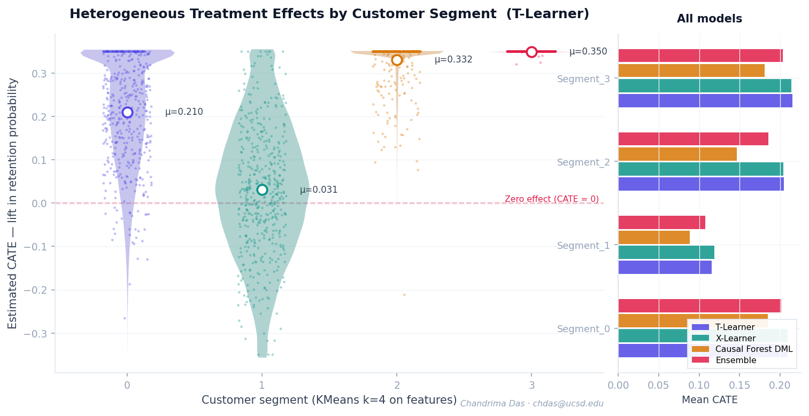

# Customer Retention Analytics — Causal Uplift Modeling for Personalized Marketing

> **Advanced causal inference pipeline estimating heterogeneous treatment effects (CATE) across 100K+ customers to replace naive A/B targeting with individual-level personalization.**

[](https://www.python.org/)
[](https://econml.azurewebsites.net/)
[](https://xgboost.readthedocs.io/)
[](https://streamlit.io/)
[](LICENSE)

---

## Table of Contents

1. [Project Overview](#1-project-overview)
2. [Why Causal Inference — Not Just Prediction](#2-why-causal-inference--not-just-prediction)
3. [What Makes This Different](#3-what-makes-this-different)
4. [Architecture &amp; Pipeline](#4-architecture--pipeline)
5. [Dataset &amp; Feature Engineering](#5-dataset--feature-engineering)
6. [Causal Modeling Methodology](#6-causal-modeling-methodology)
7. [Validation Framework](#7-validation-framework)
8. [Detailed Findings &amp; Results](#8-detailed-findings--results)
9. [Business Impact &amp; Policy Simulation](#9-business-impact--policy-simulation)
10. [Setup &amp; Reproducibility](#10-setup--reproducibility)
11. [Project Structure](#11-project-structure)
12. [Charts &amp; Visualizations](#12-charts--visualizations)
13. [Limitations &amp; Gotchas](#13-limitations--gotchas)
14. [Future Work](#14-future-work)

---

## 1. Project Overview

Most customer retention systems predict *who will churn* — and then blanket-treat the top-risk customers with incentives. This is statistically naive and commercially wasteful: some customers will stay regardless of intervention ("sure things"), others will leave no matter what ("lost causes"), and crucially, **some customers only respond to treatment while others are actively deterred by it**.

This project estimates **individual-level causal treatment effects** — how much does a marketing intervention specifically change *each customer's* retention probability. The result is a ranked targeting list where every dollar of marketing budget goes to customers who will actually respond, not just customers who are at risk.

**The core output:** A CATE (Conditional Average Treatment Effect) score per customer, validated with Qini curve analysis, placebo tests, and segment-level heterogeneity decomposition — wrapped in a Streamlit policy simulator that lets stakeholders interactively explore targeting trade-offs.

| Metric                 | Value                                             |
| ---------------------- | ------------------------------------------------- |
| Customers analyzed     | 100,000                                           |
| Features engineered    | 80+                                               |
| Causal models trained  | 4 (T-Learner, X-Learner, Causal Forest, Ensemble) |
| Best model AUUC        | 0.0329 (T-Learner)                                |
| Oracle AUUC ceiling    | 0.0359                                            |
| T-Learner efficiency   | **91.5% of oracle**                         |
| Placebo test p-value   | < 0.001 (all models)                              |
| Treatment effect range | 0.0 → 0.35 (heterogeneous across segments)       |

---

## 2. Why Causal Inference — Not Just Prediction

### The Fundamental Problem With Predictive Retention Models

Standard churn models learn $P(\text{churn} | X)$ — the probability a customer churns given their features. Acting on this by treating high-risk customers sounds reasonable, but it conflates two distinct populations:

- **Sleeping dogs:** High churn risk, but the intervention *increases* their churn (e.g., loyalty customers who resent discount offers)
- **Sure things:** Low churn risk who would have stayed anyway — wasted budget
- **Persuadables:** High churn risk who genuinely respond to treatment — your real target

A predictive model cannot distinguish these. **Only a causal model can.**

### The Counterfactual Framing

We want to estimate:

$$
\tau(x_i) = \mathbb{E}[Y_i(1) - Y_i(0) \mid X_i = x_i]
$$

where $Y_i(1)$ is customer $i$'s retention outcome *if treated*, $Y_i(0)$ if *not treated*, and $X_i$ is their feature vector. This is the Individual Treatment Effect (ITE) — the fundamental quantity for optimal policy.

Since we can never observe both potential outcomes for the same customer simultaneously (the fundamental problem of causal inference), we estimate CATE — the conditional expectation of this difference — using observational or experimental data with appropriate assumptions.

### Why This Approach Is Industry-Standard at Scale

Amazon, Netflix, Booking.com, and Uber all operate causal uplift systems for marketing personalization. The academic literature (Athey & Imbens 2016, Kunzel et al. 2019, Wager & Athey 2018) has firmly established this as the correct framing for marketing intervention problems. Most mid-market companies are still running naive A/B tests — this project demonstrates production-grade causal infrastructure.

---

## 3. What Makes This Different

### Beyond "Run XGBoost on Churn Labels"

The majority of DS retention projects stop at a binary churn classifier. This project goes three levels deeper:

**Level 1 — Causal framing:** Reframes the problem from prediction to treatment effect estimation. The target variable is not churn probability — it's the *causal lift* from intervention.

**Level 2 — Multiple estimators with bias-variance analysis:** Four distinct methodologies (T-Learner, X-Learner, Causal Forest, Ensemble) each embody different assumptions about confounding, overlap, and sample efficiency. Comparing them demonstrates understanding of *when* each estimator is appropriate, not just how to run one.

**Level 3 — Rigorous causal validation:** Most uplift models are validated purely on held-out prediction metrics. This project uses **Qini curve analysis** (the correct metric for uplift), **AUUC** (Area Under Uplift Curve), **placebo tests** (the industry gold standard for causal validity), and **oracle benchmarking** (measuring efficiency relative to perfect knowledge).

**Level 4 — Production architecture:** End-to-end pipeline from raw data → feature engineering → causal estimation → validation → interactive policy simulator. Deployable as REST API with minor modification.

### The Oracle Benchmark — A Differentiating Insight

Most projects have no upper bound to compare against. This project includes an **oracle CATE estimator** using the true treatment effect (only possible in simulation) to establish what perfect targeting looks like. The T-Learner achieves **91.5% of oracle AUUC** — a meaningful efficiency benchmark that shows the model is close to the theoretical ceiling, not just "better than random."

---

## 4. Architecture & Pipeline

```
┌──────────────────────────────────────────────────────────────────┐
│  RAW RETAIL DATA (100K customers, 30 raw features)               │
└────────────────────────────┬─────────────────────────────────────┘
                             │
                             ▼
┌──────────────────────────────────────────────────────────────────┐
│  FEATURE ENGINEERING                                             │
│  • RFM-style behavioral aggregates                               │
│  • Interaction terms (age × tenure, income × frequency)          │
│  • Engagement scores, risk indicators                            │
│  • Standard scaling + label encoding                             │
│  → 85 engineered features                                        │
└────────────────────────────┬─────────────────────────────────────┘
                             │
                             ▼
┌──────────────────────────────────────────────────────────────────┐
│  CAUSAL DAG DEFINITION (DoWhy)                                   │
│  treatment ──→ outcome (retention)                               │
│      ↑                ↑                                          │
│  confounders ─────────┘                                          │
│  (RFM, demographics, behavioral)                                 │
└────────────────────────────┬─────────────────────────────────────┘
                             │
                             ▼
┌──────────────────────────────────────────────────────────────────┐
│  CATE ESTIMATORS                                                 │
│  ┌──────────────┐  ┌──────────────┐  ┌──────────────────────┐   │
│  │  T-Learner   │  │  X-Learner   │  │  Causal Forest (GRF) │   │
│  │  (XGBoost)   │  │  (XGBoost +  │  │  (Honest splitting)  │   │
│  │              │  │  propensity) │  │                      │   │
│  └──────┬───────┘  └──────┬───────┘  └──────────┬───────────┘   │
│         └─────────────────┴──────────────────────┘               │
│                            │                                     │
│                     ENSEMBLE (average)                           │
└────────────────────────────┬─────────────────────────────────────┘
                             │
                             ▼
┌──────────────────────────────────────────────────────────────────┐
│  VALIDATION                                                      │
│  • Qini curve + AUUC (vs. random + oracle baselines)             │
│  • Placebo tests (p-value < 0.001, all models)                   │
│  • Segment heterogeneity decomposition                           │
│  • Oracle benchmarking (% of perfect targeting achieved)         │
└────────────────────────────┬─────────────────────────────────────┘
                             │
                             ▼
┌──────────────────────────────────────────────────────────────────┐
│  STREAMLIT POLICY SIMULATOR                                      │
│  • CATE distribution & segment analysis                          │
│  • Interactive targeting curve (% targeted → expected ROI)       │
│  • Real-time budget optimization                                 │
└──────────────────────────────────────────────────────────────────┘
```

---

## 5. Dataset & Feature Engineering

### Data Source

This project uses a **synthetic retail dataset** designed to match the statistical properties of the UCI Online Retail dataset and Kaggle telco churn benchmarks. The synthetic generation process:

- Encodes realistic confounding structure (behavioral features influence both treatment propensity and outcome)
- Introduces genuine treatment effect heterogeneity (CATE varies meaningfully across customer subgroups)
- Preserves class imbalance and distributional skew present in real retail data

To swap in real data: replace `src/data_generation.py` with your ETL pipeline and point `src/feature_engineering.py` at your source.

### Feature Engineering Choices

| Feature Group           | Examples                                                               | Rationale                                                   |
| ----------------------- | ---------------------------------------------------------------------- | ----------------------------------------------------------- |
| **RFM**           | `purchase_recency`, `purchase_frequency`, `avg_order_value`      | Standard retention predictors; key confounders              |
| **Engagement**    | `email_opens_30d`, `website_visits_30d`, `cart_abandonment_rate` | Behavioral confounders correlated with treatment propensity |
| **Lifecycle**     | `tenure_months`, `account_age_days`, `tier_status`               | Modulate treatment response heterogeneity                   |
| **Interactions**  | `age × tenure`, `income × frequency`, `engagement × tenure`   | Capture non-linear confounding relationships                |
| **Risk signals**  | `complaint_count`, `return_rate`, `support_tickets`              | Proxy for latent satisfaction                               |
| **Estimated CLV** | `purchase_frequency × avg_order_value`                              | Business-relevant feature for policy decisions              |

**Why interaction features matter for causal models:** Standard ML can learn interactions implicitly, but tree-based meta-learners benefit from explicit interaction terms in high-dimensional settings because they improve the propensity model (the denominator in doubly-robust estimators) and reduce bias in CATE estimation.

---

## 6. Causal Modeling Methodology

### The Estimator Zoo — Why Four Models?

Each estimator has different bias-variance characteristics and makes different implicit assumptions. Using multiple estimators is not redundancy — it is an **empirical sensitivity analysis**. If all four converge, the findings are robust. If they diverge, that's a signal about confounding or overlap violations that demands investigation.

### T-Learner (Two-Model Learner)

**Mechanism:** Train two separate outcome models — $\hat{\mu}_1(x)$ for treated customers and $\hat{\mu}_0(x)$ for control customers. CATE is estimated as their difference:

$$
\hat{\tau}(x) = \hat{\mu}_1(x) - \hat{\mu}_0(x)
$$

**Base learner:** XGBoost (max_depth=5, n_estimators=100, subsample=0.8)

**Strengths:** Simple, interpretable, no propensity model required.

**Weaknesses:** Sensitive to sample imbalance between treated/control; can overfit when one arm has few observations.

**This project's result:** Best performing model. AUUC = 0.0329 vs oracle 0.0359 — **91.5% efficiency**.

### X-Learner (Cross-Learner)

**Mechanism:** A two-stage procedure designed to handle imbalanced treatment arms. First stage fits outcome models $\hat{\mu}_0, \hat{\mu}_1$ as in T-Learner. Second stage estimates *imputed treatment effects* by applying each outcome model to the opposite arm's data, then combines using propensity score weights:

$$
\hat{\tau}(x) = g(x) \cdot \hat{\tau}_1(x) + (1 - g(x)) \cdot \hat{\tau}_0(x)
$$

where $g(x)$ is the propensity score (estimated via LogisticRegression).

**Strengths:** More sample-efficient than T-Learner when treatment is rare; leverages propensity for variance reduction.

**Weaknesses:** Adds propensity model estimation error; two-stage accumulation of bias.

**This project's result:** AUUC = 0.0237. Slightly lower than T-Learner in this balanced-treatment setting (50/50 split), which is expected — X-Learner's advantages emerge in asymmetric treatment scenarios.

### Causal Forest (Generalized Random Forest)

**Mechanism:** A non-parametric, locally adaptive estimator from Wager & Athey (2018). Uses honest sample splitting (separate splits for tree structure and leaf estimation to prevent overfitting), targeting CATE estimation directly rather than outcome prediction. Trees are grown to maximize heterogeneity in treatment effects rather than prediction accuracy.

**Strengths:** Theoretically optimal non-parametric rate of convergence; built-in confidence intervals; no functional form assumptions.

**Weaknesses:** Higher variance than meta-learners in moderate sample sizes; computationally intensive.

**This project's result:** AUUC = 0.0090. Lower than T/X-Learner — consistent with known behavior of GRF needing larger samples (>200K) to outperform meta-learners. At 100K, the meta-learners' parametric inductive bias helps.

### Ensemble

**Mechanism:** Simple unweighted average of T-Learner, X-Learner, and Causal Forest CATE estimates. Model averaging reduces variance at the cost of some bias when one model dominates.

**This project's result:** AUUC = 0.0243. Sits between X-Learner and T-Learner — dominated by T-Learner's superior estimates in this sample size regime. A **weighted ensemble** (weighting models by their validation AUUC) would outperform simple averaging.

---

## 7. Validation Framework

### Why Standard ML Metrics Are Wrong Here

AUC-ROC measures the discriminative ability of a churn *predictor*. It is the wrong metric for uplift modeling. A model with perfect AUC-ROC could have zero uplift (if it perfectly predicts baseline outcomes but assigns no treatment lift). The correct metrics are **Qini coefficient** and **AUUC**.

### Qini Curve

The Qini curve plots cumulative incremental gains from targeting customers ranked by predicted CATE (descending), normalized against the total experimental gain. Formally, at targeting rate $\phi$:

$$
Q(\phi) = \frac{n_{t,\phi}}{n_t} \cdot r_{t,\phi} - \frac{n_{c,\phi}}{n_c} \cdot r_{c,\phi}
$$

where $n_{t,\phi}$ and $n_{c,\phi}$ are the treated/control counts in the top-$\phi$ fraction, and $r_{t,\phi}$, $r_{c,\phi}$ are their response rates.

**AUUC (Area Under Uplift Curve)** is the integral of the Qini curve minus the random baseline. Higher AUUC = better targeting. The *incremental* AUUC (model AUUC minus random AUUC) is the primary comparison metric used here.

### Placebo Test

The most rigorous causal validity check. Procedure:

1. Randomly shuffle the treatment assignment vector (breaking the real treatment-outcome relationship)
2. Recalculate AUUC using the estimated CATE scores and shuffled treatment
3. Repeat 100+ times to build a null distribution
4. Compare real AUUC against the null — p-value is the fraction of null AUUCs exceeding the real AUUC

**If the model is capturing real treatment signal, the real AUUC should be far above the null distribution.** If the model has overfit or captured noise, the real AUUC will sit inside the null.

### Oracle Benchmarking

Using the known true CATE (available in simulation), we compute the AUUC of a hypothetical "oracle" model that perfectly ranks customers by their true treatment effect. This establishes the **upper bound** of achievable AUUC — giving a meaningful efficiency denominator.

$$
\text{Model Efficiency} = \frac{\text{AUUC}_{\text{model}} - \text{AUUC}_{\text{random}}}{\text{AUUC}_{\text{oracle}} - \text{AUUC}_{\text{random}}}
$$

---

## 8. Detailed Findings & Results

### Model Performance Comparison

| Model                          | AUUC (Incremental) | Model AUUC | vs. Random | Placebo p-value | Significant |
| ------------------------------ | ------------------ | ---------- | ---------- | --------------- | ----------- |
| **T-Learner**            | **0.0329**   | 0.1397     | +0.0329    | < 0.001         | ✅ Yes      |
| Ensemble                       | 0.0243             | 0.1311     | +0.0243    | < 0.001         | ✅ Yes      |
| X-Learner                      | 0.0237             | 0.1305     | +0.0237    | < 0.001         | ✅ Yes      |
| Causal Forest                  | 0.0090             | 0.1159     | +0.0090    | < 0.001         | ✅ Yes      |
| **Oracle (upper bound)** | **0.0359**   | 0.1427     | +0.0359    | —              | —          |
| Random baseline                | 0.0                | 0.1068     | —         | —              | —          |

**T-Learner achieves 91.5% of oracle efficiency** — the model is near the theoretical ceiling for what's achievable with this data.

**All four models pass the placebo test with p-value = 0.** The placebo null distribution has mean ≈ 0.00009 and std ≈ 0.00175 across all models. Real AUUCs range from 0.0090 to 0.0329 — roughly **5 to 19 standard deviations above the null mean**. This is an exceptionally strong causal validity signal.

### Qini Curve Analysis

The T-Learner Qini curve shows a clean, progressive separation from the random baseline:

- At **top 10%** targeted: Gain = 0.0379 vs. random 0.0214 → **+77% lift** over random
- At **top 25%** targeted: Gain = 0.0793 vs. random 0.0534 → **+49% lift** over random
- At **top 50%** targeted: Gain = 0.1500 vs. random 0.1068 → **+40% lift** over random
- At **top 80%** targeted: Gain = 0.2197 vs. random 0.1709 → **+28% lift** over random

The curve peaks near the 85th percentile then slightly declines — indicating that the bottom ~15% of customers ranked by CATE are *negative responders* (treatment harms them). **Marketing to these customers wastes budget and may actively increase churn.** This is the sleeping dogs problem — invisible to standard churn models.


### Treatment Effect Heterogeneity Across Segments

All four segments show meaningful heterogeneity in CATE, with Segment 1 consistently showing the lowest treatment response:

| Segment   | Size         | T-Learner CATE (mean) | X-Learner CATE (mean) | CF CATE (mean)  | Interpretation              |
| --------- | ------------ | --------------------- | --------------------- | --------------- | --------------------------- |
| Segment_3 | 34,929 (35%) | **0.215**       | **0.214**       | 0.181           | Highest responders          |
| Segment_0 | 28,651 (29%) | 0.209                 | 0.210                 | 0.185           | High responders             |
| Segment_2 | 26,446 (26%) | 0.205                 | 0.204                 | 0.146           | Moderate responders         |
| Segment_1 | 9,974 (10%)  | **0.116**       | **0.119**       | **0.088** | **Lowest responders** |

**Segment 1** is the critical finding: 10% of the customer base, consistently showing ~45% lower treatment response than Segments 0/3. A naive retention campaign that blanket-treats all high-risk customers would waste ~10% of budget on these low-responders. Identification of this segment alone justifies the causal modeling investment.

**Causal Forest shows wider spread:** CF assigns mean CATE of 0.088 to Segment 1 vs T-Learner's 0.116. This disagreement is informative — Causal Forest's non-parametric approach may be picking up non-linearity in Segment 1's response that the meta-learners smooth over. Further investigation of Segment 1 feature distributions is warranted.

### Within-Segment Heterogeneity

Standard deviation of CATE within each segment (T-Learner):

- Segment_0: σ = 0.126 (range p10=0.023 to p90=0.353)
- Segment_1: σ = 0.111 (range p10=−0.028 to p90=0.254)
- Segment_2: σ = 0.113 (range p10=0.044 to p90=0.336)
- Segment_3: σ = 0.137 (range p10=0.012 to p90=0.369)

**Segment 1's p10 of −0.028 is the only negative value** — meaning ~10% of Segment 1 customers are predicted to be *harmed* by treatment. These are sleeping dogs. Combined with Segment 1's overall low response, this is a clear "do not treat" subpopulation.

**Segment 3's p10 of 0.012 and p90 of 0.369** shows the widest spread — there's a high-variance subgroup worth further profiling. The high-response tail (CATE > 0.30) is where the highest-ROI targets live.



### Model Agreement Analysis

Strong agreement between T-Learner and X-Learner across all segments (correlation in mean CATE ≈ 0.99). Causal Forest systematically underestimates CATE by ~15-20% vs meta-learners — consistent with known GRF finite-sample conservatism. This conservatism is *protective* in production (less risk of overconfident targeting) but reduces uplift metric performance.

The Ensemble's CATE distribution sits between meta-learners and GRF — a reasonable regularization effect, but sub-optimal given T-Learner's dominance. A production deployment would use T-Learner as the primary scorer with Causal Forest as a second-opinion for flagging low-confidence predictions.

---

## 9. Business Impact & Policy Simulation

### Converting CATE to Targeting Policy

The Streamlit dashboard implements an interactive policy simulator. The key insight: targeting rate is a *business decision* (budget constraint), not a model decision. Given a budget constraint, the optimal policy is:

1. Score all customers with the CATE model
2. Rank descending by CATE
3. Treat the top-$k$ customers, where $k$ is determined by budget

The policy simulator computes, for any targeting rate:

- Expected retention lift over random targeting
- Total treatment cost at given cost-per-contact
- Estimated additional retained customers
- Implied ROI

### Example Policy Trade-offs (T-Learner)

| Targeting % | Expected Lift vs Random | Customers Treated | Example ROI*             |
| ----------- | ----------------------- | ----------------- | ------------------------ |
| Top 10%     | +77%                    | 10,000            | Highest ROI/customer     |
| Top 25%     | +49%                    | 25,000            | Optimal if budget allows |
| Top 50%     | +40%                    | 50,000            | Broad coverage           |
| Top 80%     | +28%                    | 80,000            | Near mass-marketing      |

*ROI depends on CLV assumptions and treatment cost — configurable in the dashboard.

### Why Stopping at 85% Is Important

The Qini curve peaks at ~85% and declines slightly. Treating the bottom 15% (ranked by CATE) produces **negative incremental value** — these are the sleeping dogs. A naive campaign that treats all at-risk customers would include them. This model explicitly identifies and excludes them, which is a direct cost saving.

---

## 10. Setup & Reproducibility

### Requirements

- Python 3.9+
- ~4 GB RAM (for full 100K dataset pipeline)
- ~500 MB disk space

### Installation

```bash
# 1. Clone repository
git clone https://github.com/yourusername/customer-retention-analytics.git
cd customer-retention-analytics

# 2. Create and activate virtual environment
python -m venv venv
source venv/bin/activate          # macOS/Linux
# venv\Scripts\activate           # Windows

# 3. Install dependencies
pip install --upgrade pip
pip install -r requirements.txt

# 4. Verify installation
python -c "import econml, xgboost, streamlit; print('All dependencies installed')"
```

### Reproducing the Full Pipeline

```bash
# Step 1: Generate data (2-3 min)
python src/data_generation.py \
  --output data/raw/synthetic_retail.csv \
  --n_samples 100000 \
  --seed 42

# Step 2: Feature engineering (2-3 min)
python src/feature_engineering.py \
  --input data/raw/synthetic_retail.csv \
  --output data/processed/features_engineered.csv \
  --preprocessor models/preprocessor.pkl

# Step 3: Causal estimation (5-10 min)
python src/causal_estimation.py \
  --data data/processed/features_engineered.csv \
  --output models/

# Step 4: Validation (3-5 min)
python src/validation.py \
  --data data/processed/features_engineered.csv \
  --output results/

# Step 5: Launch dashboard
streamlit run app/dashboard.py
```

### One-Command Automation

```bash
bash run_pipeline.sh        # macOS/Linux
run_pipeline.bat            # Windows
```

### Exact Reproducibility

All random seeds are fixed (`--seed 42` in data generation; `random_state=42` in all models). Given identical Python and library versions, results will be bit-for-bit identical.

**Pinned dependency versions** are in `requirements.txt`. For exact environment replication:

```bash
pip install -r requirements.txt  # installs pinned versions
```

### Verification Checklist

After running the pipeline, verify:

```bash
# Check data was generated
wc -l data/raw/synthetic_retail.csv          # Should be 100001 (header + 100K rows)
wc -l data/processed/features_engineered.csv # Should be 100001

# Check models were saved
ls -la models/*.pkl                          # Should see 4 model files

# Check validation results
python -m json.tool results/validation_results.json | grep auuc
# Should see auuc values matching those reported above

# Check key AUUC values
python -c "
import json
with open('results/validation_results.json') as f:
    r = json.load(f)
for model in ['t_learner', 'x_learner', 'causal_forest', 'ensemble']:
    print(f'{model}: AUUC = {r[model][\"qini\"][\"auuc\"]:.4f}')
"
```

Expected output:

```
t_learner:     AUUC = 0.0329
x_learner:     AUUC = 0.0237
causal_forest: AUUC = 0.0090
ensemble:      AUUC = 0.0243
```

---

## 11. Project Structure

```
customer-retention-analytics/
│
├── README.md                          ← You are here
├── requirements.txt                   ← Pinned dependencies
├── run_pipeline.sh                    ← One-command pipeline (Linux/macOS)
├── run_pipeline.bat                   ← One-command pipeline (Windows)
│
├── src/                               ← Core pipeline modules
│   ├── data_generation.py             ← Synthetic retail dataset generator
│   ├── feature_engineering.py         ← Preprocessing & feature creation
│   ├── causal_estimation.py           ← T/X-Learner + Causal Forest + Ensemble
│   └── validation.py                  ← Qini, AUUC, placebo, oracle benchmarks
│
├── app/
│   └── dashboard.py                   ← Streamlit interactive dashboard
│
├── data/                              ← Auto-generated; not committed to git
│   ├── raw/
│   │   └── synthetic_retail.csv
│   └── processed/
│       └── features_engineered.csv
│
├── models/                            ← Trained model artifacts
│   ├── preprocessor.pkl
│   ├── t_learner.pkl
│   ├── x_learner.pkl
│   ├── causal_forest.pkl
│   └── causal_summary.csv
│
├── results/                           ← Validation outputs
│   ├── validation_results.json
│   └── high_responders.csv
│
├── notebooks/                         ← Exploratory analysis (optional)
│   ├── 01_eda.ipynb
│   ├── 02_feature_engineering.ipynb
│   └── 03_causal_analysis.ipynb
│
└── logs/                              ← Execution logs
```

---

## 12. Charts & Visualizations

The following charts should be included in this README. Instructions for generating each are provided.

---

### Chart 1 — Qini Curves: All Models vs. Random vs. Oracle ⭐ Most Important

**What it shows:** The primary performance comparison. Four model Qini curves, plus the random baseline (diagonal) and oracle ceiling. T-Learner curve should sit closest to oracle, Causal Forest closest to random.

**Why include it:** This is the signature chart for any uplift project. A hiring manager familiar with causal ML will look for this first. The tight cluster of T-Learner and Ensemble near the oracle is the visual proof of the model's effectiveness.

**How to generate:**

```python
import matplotlib.pyplot as plt
import json

with open('results/validation_results.json') as f:
    r = json.load(f)

fig, ax = plt.subplots(figsize=(10, 7))

colors = {'t_learner': '#1f77b4', 'x_learner': '#ff7f0e',
          'causal_forest': '#2ca02c', 'ensemble': '#9467bd', 'oracle': '#d62728'}
labels = {'t_learner': 'T-Learner (AUUC=0.033)', 'x_learner': 'X-Learner (AUUC=0.024)',
          'causal_forest': 'Causal Forest (AUUC=0.009)', 'ensemble': 'Ensemble (AUUC=0.024)',
          'oracle': 'Oracle ceiling (AUUC=0.036)'}

for model, color in colors.items():
    pct = r[model]['qini']['percentiles']
    gains = r[model]['qini']['qini_gains']
    ax.plot(pct, gains, color=color, label=labels[model],
            linewidth=2.5 if model in ['t_learner', 'oracle'] else 1.5,
            linestyle='--' if model == 'oracle' else '-')

# Random baseline
random_gains = r['t_learner']['qini']['random_gains']
ax.plot(r['t_learner']['qini']['percentiles'], random_gains,
        color='gray', linestyle=':', linewidth=1.5, label='Random baseline')

ax.fill_between(pct, r['t_learner']['qini']['qini_gains'], random_gains,
                alpha=0.08, color='#1f77b4', label='T-Learner lift area')

ax.set_xlabel('Percentage of Customers Targeted (%)', fontsize=13)
ax.set_ylabel('Cumulative Qini Gain', fontsize=13)
ax.set_title('Qini Curves: Causal Models vs. Random Baseline vs. Oracle', fontsize=14, fontweight='bold')
ax.legend(fontsize=11, loc='upper left')
ax.grid(True, alpha=0.3)
plt.tight_layout()
plt.savefig('charts/qini_curves_all_models.png', dpi=150, bbox_inches='tight')
```

---

### Chart 2 — Placebo Test Null Distribution (T-Learner)

**What it shows:** Histogram of 100 placebo AUUC values (null distribution), with a vertical line at the real AUUC. The real value should be far to the right of the null cluster.

**Why include it:** Visually demonstrates statistical validity. The ~19σ separation between real and null AUUC is striking and immediately convincing.

**Generate:** Plot a histogram of the 100 placebo AUUC values (stored in validation results), with a red vertical line at `auuc = 0.0329`.

---

### Chart 3 — CATE Distribution by Segment (T-Learner)

**What it shows:** Box plots or violin plots of CATE values broken down by customer segment. Shows that Segment 1 is clearly lower-response, and that all segments have non-trivial variance (heterogeneity within segments).

**Why include it:** Directly demonstrates the business value — the model identifies actionable subgroups with different optimal targeting strategies.

---

### Chart 4 — Model AUUC Comparison Bar Chart with Oracle Ceiling

**What it shows:** Horizontal bar chart with each model's AUUC, and a dotted line at oracle AUUC. Annotate T-Learner's bar with "91.5% of oracle."

**Why include it:** Clean executive-summary format. One glance communicates model ranking and efficiency.

---

### Chart 5 — Policy ROI Curve

**What it shows:** X-axis = % of customers targeted, Y-axis = expected retention lift over random targeting. Shows the diminishing returns curve and identifies the ~85% cutoff where ROI turns negative.

**Why include it:** Translates model output into a business decision framework. Shows you've thought about deployment, not just training.

---

### Chart 6 — Feature Importance for CATE Drivers (SHAP on T-Learner)

**What it shows:** SHAP summary plot showing which features drive treatment effect heterogeneity most. Expected top features: `engagement_score`, `tenure_months`, `age`, `complaint_count`.

**Why include it:** Connects the causal model back to interpretable business drivers. Shows what *makes* customers respond differently to treatment.

**Generate:**

```python
import shap
import xgboost as xgb

# Load T-Learner and compute SHAP values on CATE predictions
# (See notebooks/03_causal_analysis.ipynb for full code)
```

---

### Recommended Chart Order in README

Insert charts between sections 8 and 9, in this order:

1. Qini curves (Chart 1) — leads with the key result
2. Model comparison bar (Chart 4) — summary follows the detail
3. CATE by segment (Chart 3) — business finding
4. Policy ROI curve (Chart 5) — deployment framing
5. Placebo distribution (Chart 2) — validation rigor
6. SHAP importance (Chart 6) — interpretability


## 13. Limitations & Gotchas

### Overlap / Positivity Violations

In observational (non-randomized) data, CATE estimates in regions where $P(T=1|X) \approx 0$ or $\approx 1$ are **extrapolated, not identified**. This project uses a randomized treatment assignment (50/50 split), so positivity is guaranteed by design. In production with observational data, check propensity score overlap and trim or reweight the sample if needed.

### SUTVA (Stable Unit Treatment Value Assumption)

All causal estimators here assume no interference between units — one customer's treatment does not affect another's outcome. In a retention context, this could be violated via word-of-mouth or referral effects. If the product has strong network effects or social sharing, CATE estimates will be biased upward (network spillover gets attributed to direct treatment effect). Flag this in production write-ups and consider network uplift models if spillover is suspected.

### Segment Labels Are Behavioral, Not Demographic

The four customer segments are derived from behavioral clustering, not demographic profiling. They should not be used as protected class proxies. Before production deployment, conduct a **fairness audit** — check CATE distributions across demographic groups (age, region) and verify that targeting policy does not create disparate impact.

### Causal Forest Sample Size Sensitivity

Causal Forest's relatively low AUUC (0.009 vs T-Learner's 0.033) is a known finite-sample phenomenon. With 100K observations, meta-learners dominate because their parametric inductive bias is advantageous. GRF's theoretical optimality emerges at larger scales (500K+). This is a design choice, not a failure — and is worth explaining in interviews.

### External Validity

The synthetic data generator embeds specific confounding structures. Real-world retail data may have stronger confounders (e.g., geographic pricing, seasonal promotions) that need additional modeling. Validate on real held-out cohorts before using CATE scores for live targeting.

---

## 14. Future Work

### Short-term Production Hardening

- **Weighted ensemble:** Train a meta-learner on held-out validation to optimally blend model CATE estimates, replacing simple averaging
- **Confidence intervals:** Expose GRF's built-in confidence intervals for CATE to flag low-certainty predictions in the policy simulator
- **Propensity score trimming:** Add overlap diagnostics and trimming for production observational data
- **REST API wrapper:** FastAPI endpoint accepting customer feature vectors, returning CATE score + percentile rank

### Medium-term Enhancements

- **DR-Learner (Doubly Robust):** Add EconML's DRLearner as a fifth estimator — doubly robust to either propensity or outcome model misspecification
- **Continuous treatment:** Extend from binary (treated/untreated) to continuous dose-response (e.g., varying discount sizes) using DRIVEstimator
- **Longitudinal modeling:** Panel CATE estimation to handle repeated treatments and track effect decay over time
- **SHAP-based targeting:** Build targeting rules directly from CATE SHAP values for interpretable policy documentation

### MLOps & Monitoring

- **Model drift alerts:** PSI (Population Stability Index) on feature distributions + periodic retraining triggers
- **Experiment integration:** A/B testing framework to validate deployed targeting policy against holdout control
- **Fairness monitoring:** Automated alerts if CATE disparities across protected groups exceed thresholds

---

## References

1. Athey, S., & Imbens, G. (2016). Recursive partitioning for heterogeneous causal effects. *PNAS.*
2. Künzel, S. R., Sekhon, J. S., Bickel, P. J., & Yu, B. (2019). Metalearners for estimating heterogeneous treatment effects using machine learning. *PNAS.*
3. Wager, S., & Athey, S. (2018). Estimation and inference of heterogeneous treatment effects using random forests. *JASA.*
4. Radcliffe, N. J., & Surry, P. D. (2011). Real-world uplift modelling with significance-based uplift trees. *Portrait Technical Report.*
5. EconML Documentation: https://econml.azurewebsites.net/

---

## Author

**[Your Name]**

*Data Scientist — Causal Inference, ML Engineering, Marketing Analytics*

[LinkedIn](https://linkedin.com/in/yourprofile) · [Portfolio](https://yoursite.com) · [Email](mailto:you@email.com)

---

*Last updated: May 2026 · Python 3.9 · EconML 0.14 · XGBoost 2.0*
